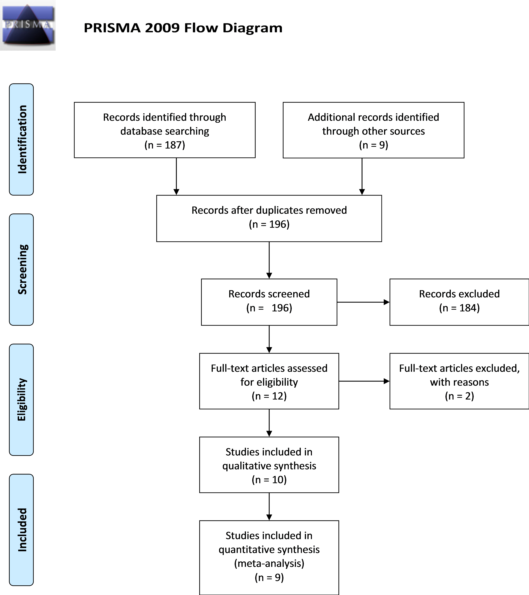
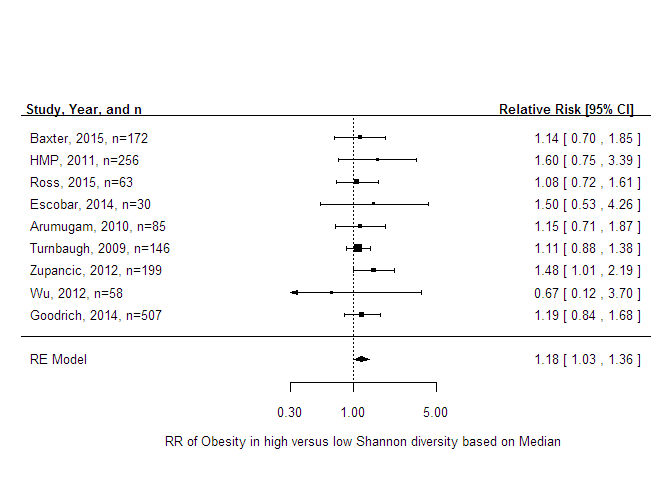
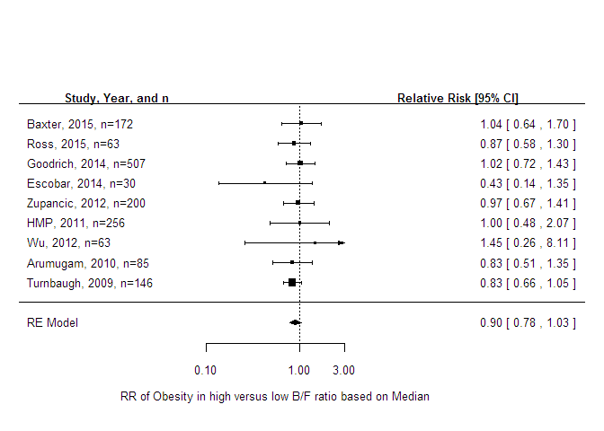
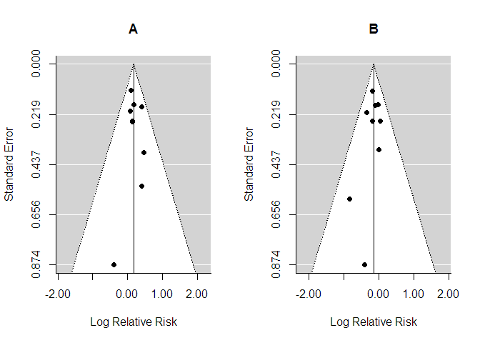
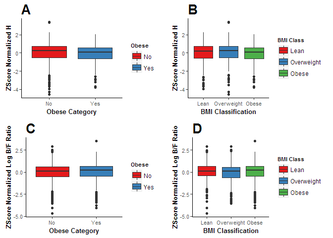

# Looking for a Signal in the Noise: Revisiting Obesity and the microbiome

Marc A Sze1 and Patrick D Schloss1

1 Department of Microbiology and Immunology, University of Michigan, Ann Arbor, MI, USA  
 
 
 
 
 
 
Corresponding author: Patrick D Schloss  
*Current Address:*  
1526 MSRB I  
Ann Arbor, MI  
USA 48109-5620  
Email: pschloss@umich.edu  
Phone: 734-936-2951    
 
 
**Contributions:** MAS (planned, designed, and performed experiments, completed data analysis, wrote first draft), PDS (planned and designed the study, data interpretation, and edited subsequent drafts).
 
**Running Title:** microbiome and Obesity
 

*******
## Abstract
**Rationale:** The hypothesis that changes in the microbiome are associated with obesity has been widely accepted. However, two recent studies re-analyzed published data and found that when the datasets were analyzed independently they could not support the hypothesis. In this meta analysis, we retested the hypothesis by increasing the number of data sets examined and investigating the effect of pooling the results across the individual datasets.

**Methods:** To identify datasets that we included in the meta analysis we followed the Preferred Reporting Items for Systematic Reviews and Meta-Analyses (PRISMA) guidelines we winnowed an initial set of 196 studies that tested the microbiome-obesity association hypothesis down to 9 studies that fit our criteria. We applied three analysis pipelines to the data from each study. First, we tested the association between community structure and diversity and the Bacteroides to Firmicutes ratio (B/F) with the subjects' body mass index (BMI) treated as a continuous or categorical value. We also used the random forest machine learning algorithm to identify community features that would allow us to to predict whether a person was obese. Second, we pooled the relative risk (RR) ratio of being obese based on characteristics of the microbiome for each study and tested for an association between RR and community diversity and B/F. Finally, we normalized the community diversity and B/F values within each dataset and pooled the data to test for an association with obesity.

**Results:** When we considered each dataset in isolation, there were no significant differences (P > 0.05) in B/F between non-obese and obese individuals. The Shannon diversity (N=1 study), OTU richness (N=2), and overall community dissimilarity (N=1) were significantly different between non-obese and obese individuals in at least one study (P<0.05). With individual studies, random forest was effective at identifying features within the datasets for differentiating between non-obese and obese individuals (mean AUC: 0.76; s.d.=0.09). In seven of the studies an OTU related to the Ruminococcaceae family was important in classification; however, the direction of the association varied between studies. When we pooled the results across studies, there was a significant difference in RR of obesity based on Shannon diversity (RR = 1.19, CI = 1.04-1.36, P-value = 0.02) and B/F ratio (RR = 0.86, CI = 0.75-0.99, P-value = 0.04). Finally, when we normalized the Shannon diversity data and pooled studies there was a significant difference between non-obese and obese individuals (difference in z-score=0.155; P=0.006) something about... B/F.

**Conclusion:** We show that by pooling the results of many individual studies we can test the generalizability of the microbiome. Our meta-analysis supports the  hypothesis that there is a difference between non-obese and obese individuals in Shannon diversity and B/F ratio, but that the effect sizes are small.

\newpage

## Introduction
Obesity is a growing worldwide health concern with approximately 20% of the youth (aged 2-19) in the United States classified as either overweight or obese [@ogden_prevalence_2014]. This number increases to approximately 35% in adults (aged 20 or older) and these statistics have seen little change since 2003 [@ogden_prevalence_2014]. Traditionally the body mass index (BMI) has been used as the traditional method of classifying individuals as non-obese or obese [@lichtash_body_2013]. Recently, there has been increased interest in the role of the microbiome in modulating obesity [@brahe_can_2016; @dror_microbiota_2016]. If the microbiome does affect obesity status, then manipulating the microbiome could have a significant role in the future treatment of obesity and in helping to stem the current epidemic.

There has been a continuous stream of studies that report observing a link between the composition of microbiome and obesity. The first such study used genetically obese mice and observed that obese mice had a lower Bacteroidetes and higher Firmicutes than lean mice (lower B/F ratio associated with obesity) [@ley_obesity_2005]. Translation of this result to humans by the same researchers did not observe this effect, but did find that obese individuals had a lower diversity than lean individuals [@turnbaugh_core_2009]. Since the publication of these studies there have been a steady stream of publications on the microbiome with associated BMI data but without clear explicit mention of any significant correlations between the microbiome and obesity [@ross_16s_2015; @zupancic_analysis_2012; @nam_comparative_2011; @arumugam_enterotypes_2011; @goodrich_human_2014; @wu_linking_2011; @escobar_gut_2014]. Two re-analysis studies interrogated previously published microbiome and obesity data and concluded that the previously reported differences in community diversity and B/F among non-obese and obese individuals could not be generalized [@walters_meta-analyses_2014; @finucane_taxonomic_2014].

One critique of these re-analysis studies is that they did not aggregate the results across studies to increase the effective sample size. It is possible that there are small associations within each study that would not be significant, because the studies lacked sufficient statistical power. The purpose of this study was to perform a meta-analysis of the association between differences in the microbiome and obesity status by analyzing and applying a more systematic and synthetic approach than was used previously. Our goal was to provide additional clarity on the possible relationship between community diversity, B/F, and community composition and obesity status.

## Methods
***Literature Review and Study Inclusion***
We followed the Preferred Reporting Items for Systematic Reviews and Meta-Analyses (PRISMA) guidelines to identify studies to include in our meta-analysis [@moher_preferred_2010]. A detailed description of our selection process and the exact search terms are provided in the Supplement [Figure 1]. Briefly, we searched PubMed for original research studies that involved studying obesity and the human microbiome. The initial search yielded 187 studies. We identified nine additional studies that were not designed to explicitly test for an association between the microbiome and obesity. We then manually curated the 196 studies to select those studies that included BMI and sequence data. This yielded 10 eligible studies. An additional study was removed from our analysis because no individuals in the study had a BMI over 30. Among the final 9 studies, 3 were from identified from our PubMed search [@turnbaugh_core_2009; @zupancic_analysis_2012; @escobar_gut_2014], 5 were originally identified from the 9 studies that did not explicitly investigate obesity but included BMI data [@ross_16s_2015; @arumugam_enterotypes_2011; @goodrich_human_2014; @wu_linking_2011; @Huttenhower2012], and one dataset was used (Baxter) because at the time of our analysis it was unpublished and enabled us to mitigate against publication biases associated with the bacterial microbiome and obesity. The nine studies are summarized in Tables 1 and 2.

***Sequence Analysis Pipeline***
All sequence data were publicly available and were downloaded from the NCBI Sequence Read Archive, the European Nucleotide Archive, or the investigators' personal website (https://gordonlab.wustl.edu/TurnbaughSE\_10\_09/STM\_2009.html). The nine studies used 454 [@turnbaugh_core_2009; @zupancic_analysis_2012; @ross_16s_2015; @escobar_gut_2014; @wu_linking_2011; @Huttenhower2012] or Illumina sequencing [@goodrich_human_2014; @arumugam_enterotypes_2011; Baxter]. All of these studies used amplification-based 16S rRNA gene sequencing except for one, which used metagenomic shotgun sequencing [@arumugam_enterotypes_2011]. Among the studies that sequenced the 16S rRNA gene, the researchers targeted the V1-V2  [@wu_linking_2011], V1-V3 [@ross_16s_2015; @escobar_gut_2014; @zupancic_analysis_2012], V3-V5 [@Huttenhower2012], and V4 [@goodrich_human_2014] regions. For those studies where multiple regions were sequenced,  we selected the region that corresponded to the largest number of subjects [@turnbaugh_core_2009; @Huttenhower2012]. We processed the 16S rRNA gene sequence data as described in the original studies. The taxonomic data from the metagenomic shotgun sequence data were obtained using Metaphlan2 [@truong_metaphlan2_2015]. A detailed and reproducible description of how the data were processed can be found at https://github.com/SchlossLab/Sze_ObesityMicrobiomeMeta_PeerJ_2016/.

***Data Analysis***
We performed the analysis using R (3.2.2). We split the overall analysis into three general strategies. In the first strategy we followed the approach employed by Finucane et al [-@finucane_taxonomic_2014] and Walters et al [-@walters_meta-analyses_2014] where each study was re-analyzed separately to identify associations between BMI and the relative abundance of Bacteroidetes and Firmicutes, the ratio of Bacteroidetes and Firmicutes relative abundances (B/F), Shannon diversity, and number of OTUs. A two-tailed Wilcoxon test was performed for comparison for non-obese and obese individuals. We also measured the Spearman correlation coefficient between each metric and the actual BMI value. Next, we compared the community structure from non-obese and obese individuals using PERMANOVA analysis of Bray-Curtis distance matrices. This analysis was performed using the vegan R package. Finally, we used the AUCRF R package to implement a Random Forest analysis to identify the best OTUs and alpha-diversity metrics for distinguish non-obese and obese individuals.

In the second strategy, we pooled the relative risk (RR) values for each study. For each study we partitioned the subjects into a low or high group depending on whether their diversity or B/F was below or above the median value for the study. The RR was then calculated as the ratio of the number of obese individuals in the low group to the number of obese individuals in the high group. We then performed a Fisher exact-test to test whether the RR was significantly different from 1.0 using the epiR (v0.9-6.9) and metafor (v1.9-8) packages. Finally, we assessed the potential publication bias in the diversity and B/F analyses using a funnel plot.

In the third strategy, we normalized the diversity and B/F data within each study and pooled the normalized data across studies. We applied a Z-score normalization to the Shannon diversity data and log-transformed B/F data within each study to have a mean of zero and standard deviation of one. We then pooled Z-scores across studies and used a two-tailed T-test on the values to test for a significant difference in Z-scores among non-obese and obese individuals. To assess differences between the lean, overweight, and obese BMI categories we used ANOVA with a Tukey post hoc test. We also measured the Spearman correlation coefficient between the Z-scores for each metric and BMI values.

## Results:

***Separate Analysis***
We used the categorical variable of obese or non-obese to analyze each data set separately for significant correlations to Bacteroidetes, Firmicutes, Bacteroidetes/Firmicute (B/F) ratio, Shannon diversity, OTU richness, evenness, and the Bray-Curtis distance matrix which was a similar approach taken by two previous reviews [@walters_meta-analyses_2014; @finucane_taxonomic_2014]. Using a P-value cutoff for significance as less than 0.05 we found a total of 1 significant result for Shannon diversity, 2 significant results for OTU richness, and 1 signficant result for the Bray-Curtis distance matrix. There were no significant results for Bacteroidetes, Firmicutes, or the B/F ratio. The full summary of the exact P-values for each respective study and variable tested can be found in table 3.

Next we investigated how well the OTUs in each study were able to classify obese and non-obese individuals using the random forest algorithm. We found that the average Out Of Bag (OOB) Area Under the Curve (AUC) was 0.7553 +/- 0.0855. We found that the total range for the total number of variables used for the classification ranged from 3 (Ross and Escobar) to 40 (Zupancic). The total number of trees and node size was standardized to 1000 and 20 respectively for each data set. One aspect we found surprising was that there was very little overlap in the variables used by the random forest algorithm for the classification of obese and non-obese individuals by study. The three most common variables was for an OTU that could be classified to the family Ruminococcaceae (7/9 studies), an OTU that could be classified to the family Lachnospiraceae (5/9 studies), and the Shannon diversity metric (4/9 studies).

***Classical Pooled Meta-analysis***

We next moved on to the pooled meta-analysis. For the Shannon diversity RR, all studies but Wu et al had those with a lower Shannon diversity then the median as being higher risk for obesity [Figure 2]. This was confirmed with the pooled analysis showing an increased RR of 1.18 (CI 1.03, 1.36) for obesity in the lower then median Shannon diversity group (P-value = 0.0187). When investigated the B/F ratio RR most studies showed that a low B/F ratio tended to have less obese individuals than those with a high B/F ratio [Figure 3]. A notable exception to this was the HMP data set and the Baxter data set [Figure 3]. The pooled RR was 0.86 (CI 0.75, 0.99) suggesting that a low B/F ratio does indeed have less obese individuals (P-value = 0.0376).

We also used a funnel plot to asses the bias of the 9 data sets used in this meta-analysis. From the graph we can observe that there does not seem to be any significant  bias [Figure 4]. Both funnel plots have almost equal number of studies scattered on either side of the estimated true value.

The final forest plot that we used for this analysis investigated how the different OTUs, classified to Ruminococcaceae, that were important for the classification of obese and non-obese based on the OOB AUC in the the separate study analysis looked when pooled together to assess the RR [Figure S4]. There was no significant increase in RR based on the Ruminococcaceae OTU (RR = 0.96 (CI 0.60, 1.52), P-value = 0.8575). Thus it would seem that although Ruminococcaceae is important for classification the directionality is study dependent [Figure S4].

***Z-Score Normalization Pooled Analysis***

Using the third approach with Z-score normalization we found that there was a significant difference in the Shannon diversity between the obese and non-obese group (P-value = 0.00493) [Figure 5A]. Further there was also a significant difference in this normalized Shannon diversity value when the data was split between the three BMI groups (P-value = 0.03826) [Figure 5B]. Using a Tukey post hoc test this difference was driven by the overweight versus the obese group (P-value = 0.03945). However, in contrast to this result we found that the B/F ratio, using the Z-score normalization, was not significant different between obese and non-obese individuals (P-value = 0.4516) [Figure 5C]. Additionally, we did not observe a difference when the individuals were separated by BMI groups (P-value = 0.3317) [Figure 5D].

*******
##### Discussion:

However, other methods do exist, such as body adiposity index (BAI) but do not always correlate with important molecular measures traditionally associated with obesity [@lichtash_body_2013].

* hyper variation between humans may mute the actual signal.

* just because we can't find a human-wide signal, doesn't mean microbiome isn't important for weight

* [@ley_microbial_2006] watched humans lose weight and communities change
* [@turnbaugh_effect_2009] did fecal transplants (humans to mice) and transferred phenotype
* [@koren_host_2012] did fecal transplants (pregnant women to mice) and transferred phenotype

Our meta-analysis helps to provide a little more clarity to the on going debate of whether or not there are specific microbiome variables that are influenced by obesity. Two previous reviews [@walters_meta-analyses_2014; @finucane_taxonomic_2014] have stated that the data do not support that there is a microbiome difference between non-obese and obese individuals. However, neither of these studies made an attempt to pool the existing data together to try and harness the additional power that this would give. Here we perform an extensive literature review of the existing studies on the microbiome and obesity and perform a meta-analysis on the studies that remained based on our inclusion and exclusion criteria. We analyze the data using three different approaches. The first approach uses the method taken by the previous reviews [@walters_meta-analyses_2014; @finucane_taxonomic_2014], the second approach takes a meta-analysis approach using RR representation by forest plots and funnel plots, the final approach also takes a meta-analysis approach but uses Z-score normalizations and does not use RR.

Overall, the first approach in this study by and large agrees with the prevous two reviews[@walters_meta-analyses_2014; @finucane_taxonomic_2014], in that for the majority of studies, no significant correlation between the microbiome and obestiy could be observed. However, we found that the other two approaches, that used the pooled data, was able to identify a correlation between measures of the microbiome and obesity [Figure 2 & 3]. For Shannon diversity both approaches using the pooled data found a correlation while only one of the approaches for the B/F ratio found a correlation. Taken together we believe that this analysis provides a strong preliminary finding that there is a small but detectable difference between non-obese and obese individuals with respect to both Shannon diversity and the B/F ratio. However, it should be noted that our analysis would indicate that the signal for Shannon diversity may be more robust than that of the B/F ratio since the two different pooled analysis approaches found Shannon diversity significant while only one did for the B/F ratio.

We do acknowledge that this study does have a few limitations that are worth mentioning. First,  it has been documented that in a number of groups BMI is not a good classification of obesity [@who_expert_consultation_appropriate_2004; @rahman_accuracy_2010]. Of particular note, the asian population has a separate set of guidelines for obesity [@who_expert_consultation_appropriate_2004]. Although the asain population in the studies analyzed are very small [Table 1] it is possible that this may contribute to some of the noise in the data. However, it is important to keep in mind that for these measures, specifically the RR, there does not seem to be any study bias due to studies having more ethnic diversity [Figure 4]. Additionally, we are also limited in our BMI classifications by what the previous studies published and performed. In general, not enough studies have been done to investigate the microbiome in the context of other markers for obesity or on different ethnicities to be able to perform the analysis that we did. Thus as more specific studies are published that address ethnicity and studies on the microbiome that use better markers of obesity are completed it is entirely possible that the noise associated with these measurements will decrease.    

Second, although we make attempts to normalize the data for the pooled analysis so that we can compare the microbiome across studies it is possible that the different variable regions sampled, sequencing machines used, and the quality of the output data could have an impact on the overall conclusions reached. However, what our analysis shows is that despite these differences, we are still able to identify an overall signal from the data.
Third, this meta-analysis and review of the data to date is still rather preliminary. Only a total of 1542 individuals were included in the pooled analysis which is relatively small compared to other meta-analysis in non-microbiome fields of study. It will be necessary to continuously update this analysis, as more studies become available, in order to obtain a more accurate estimate of the true effect that obesity has on the microbiome within humans.

Fourth, although a significant result exists for the RR for both Shannon diversity and the B/F ratio, it is small. This is also the case for the Z-score normalization analysis of the Shannon diversity. As an example, a lower than median Shannon diversity only has an overall 18% increase of obesity in it versus the higher than median Shannon diversity group. So even though there is a detectable signal it remains to be seen if this is a biologically significant phenomenon that could have a tangible effect on obesity.

Despite the many problems that could add more noise to the measurements used, this study provides a reasonable first pass attempt to pool this data together in an effort to find a correlation between the microbiome and obesity. In doing so we believe that it provides a tanatalizing result that despite the large differences between studies it is still possible to detect a correlation between the microbiome and obesity. However, we emphaszie that it should still be viewed with caution since there are still many aspects of this analysis that could be improved upon. It truly is only a first attempt at trying to summerize and analyze the pooled data that is available. We hope that this study helps to add important information and clarity to the on-going dialogue of the microbiome's role in obesity.

*******
##### Acknowledgements:

The authors would like to thank Nielson Baxter for his help and suggestions during the sequence analysis portion. We would also like to thank Shawn Whitefield for her help with making sure the manuscript adhered to the guidelines set out for a meta-analysis. Finally, we would like to thank Rick Bushman, Hongzhe Li, and Pixu Shi in agreeing to release and helping to get a hold of the subject specific metadata from the Wu et al study.

\newpage

## Tables

**Table 1. Summary Demographics of Individuals used in the Meta-analysis.**

|    Study    |    Age (SD)     |  Sex (F&#124;M)  |  European Ancestry (%)  |    BMI (SD)     |  Min BMI  |  Max BMI  |
|:-----------:|:---------------:|:----------------:|:-----------------------:|:---------------:|:---------:|:---------:|
|   Baxter    |  54.29 ( 9.93)  |  111 &#124; 61   |          88.00          |  26.96 (5.33)   |   17.53   |   46.88   |
|    Ross     |  57.03 (11.16)  |   48 &#124; 15   |          0.00           |  31.63 (5.27)   |   22.1    |   47.9    |
|  Goodrich   |  61.48 ( 8.94)  |   505 &#124; 2   |           NA            |  26.35 (4.92)   |   16.17   |   44.83   |
|   Escobar   |  38.10 (11.08)  |   14 &#124; 16   |          0.00           |  27.44 (4.51)   |   19.5    |   37.6    |
|  Zupancic   |  46.74 (13.05)  |  113 &#124; 87   |         100.00          |  27.69 (5.28)   |   18.2    |   51.1    |
|     HMP     |  26.14 ( 5.01)  |  127 &#124; 129  |          82.81          |  24.14 (3.41)   |    19     |    34     |
|     Wu      |  26.36 ( 9.05)  |   34 &#124; 29   |           NA            |  24.33 (4.71)   |   14.04   |   41.29   |
|  Arumugam   |  56.55 ( 7.45)  |   45 &#124; 40   |           NA            |   27.8 (5.84)   |   18.59   |   40.21   |
|  Turnbaugh  |  21-32 (   NA)  |  Not Available   |          51.00          |  Not Available  |    NA     |    NA     |

* For Turnbaugh only BMI group information was provided and only an age range was given.

\newpage

**Table 2. Summary of Important Study Characteristics.**

|    Study    |   Study Type    |                              Population                              |  Published  |                                   Outcomes Reported                                   |
|:-----------:|:---------------:|:--------------------------------------------------------------------:|:-----------:|:-------------------------------------------------------------------------------------:|
|   Baxter    |  Observational  |  Adults without Cancer from Texas, Ontario, Michigan, Massachusetts  |     No      |                                   N/A (Unpublished)                                   |
|    Ross     |  Observational  |     Hispanic adults with and without type 2 diabetes from Texas      |     Yes     |                Mentions obesity, no specific correlations made though                 |
|  Goodrich   |  Observational  |           Adult twins and mothers from the United Kingdom            |     Yes     |    Christensenellaceae higher in low BMI individuals. No other correlations found.    |
|   Escobar   |  Observational  |                     Healthy adults from Columbia                     |     Yes     |                        Firmicutes less abundant at higher BMI                         |
|  Zupancic   |  Observational  |  Amish Adults with and without metabolic syndrome from Pennsylvania  |     Yes     |                Bacteroidetes/Firmicutes ratio adjusted BMI correlation                |
|     HMP     |  Observational  |                Healthy Adults from Texas and Missouri                |     Yes     |                              No significant correlations                              |
|     Wu      |  Observational  |                   Healthy Adults from Pennsylvania                   |     Yes     |                        Unweighted UniFrac Correlation with BMI                        |
|  Arumugam   |  Observational  |                     Healthy Adults from Denmark                      |     Yes     |                             No significant  correlations                              |
|  Turnbaugh  |  Observational  |                Adult twins and mothers from Missouri                 |     Yes     |  Decrease diversity, Bacteroidetes, and Actinobacteria correlated with increased BMI  |

**Table 3. Summary of P-values for Measurements of Interest for each Individual Study for Obese versus Normal**

|    Study    |  Bacteroidetes  |  Firmicutes  |  B/F Ratio  |  Shannon Diversity  |  OTU Richness  |  Evenness  |  Bray Curtis  |
|:-----------:|:---------------:|:------------:|:-----------:|:-------------------:|:--------------:|:----------:|:-------------:|
|   Baxter    |      0.207      |    0.590     |    0.190    |        0.065        |     0.039      |   0.125    |     0.064     |
|    Ross     |      0.204      |    0.380     |    0.221    |        0.285        |     0.249      |   0.383    |     0.823     |
|  Goodrich   |      0.681      |    0.508     |    0.464    |        0.789        |     0.303      |   0.993    |     0.430     |
|   Escobar   |      0.056      |    0.131     |    0.082    |        0.948        |     0.231      |   0.619    |     0.074     |
|  Zupancic   |      0.787      |    0.395     |    0.657    |        0.176        |     0.077      |   0.270    |     0.572     |
|     HMP     |      0.459      |    0.786     |    0.586    |        0.577        |     0.965      |   0.467    |     0.811     |
|     Wu      |      0.712      |    0.751     |    0.990    |        0.909        |     0.280      |   0.380    |     0.533     |
|  Arumugam   |      0.279      |    0.238     |    0.256    |        0.430        |     0.975      |   0.352    |     0.055     |
|  Turnbaugh  |      0.400      |    0.224     |    0.335    |        0.116        |     0.055      |   0.175    |     0.095     |

*******
##### Figures:

\

**Figure 1: PRISMA Flow Diagram of Total Records Searched.**  This was adapted from:  Moher D, Liberati A, Tetzlaff J, Altman DG, The PRISMA Group (2009). Preferred Reporting Items for Systematic Reviews and Meta-Analyses: The PRISMA Statement. PLoS Med 6(7): e1000097. doi:10.1371/journal.pmed1000097.

\

**Figure 2: Meta Analysis of the Relative Risk of Obesity Based on Shannon Diversity.**  Groups were divided for each study on high and low Shannon Diversity groups based on the median for that study. The overall pooled relative risk was 1.17 for the low diversity group (P-value = 0.0266).

\

**Figure 3: Meta Analysis of the Relative Risk of Obesity Based on Bacteroidetes/Firmicutes Ratio.**  Groups were divided for each study on high and low B/F ratio groups based on the median for that specific study. The overall pooled relative risk was 0.90 for the low diversity group (P-value = 0.13).

\

**Figure 4: Funnel Plot of the Shannon Diversity and Bacteroidetes/Firmicutes Ratio Relative Risk.**  **A)** Overall there does not seem to be any bias associated with the studies selected for the Shannon Diversity analysis with studies falling on either side of the predicted value and those with smaller total n falling further away from this. **B)** For the Bacteroidetes/Firmicutes ratio there does not seem to be any associated bias. The overall pattern is similar to that observed for the Shannon Diversity analysis.

\

**Figure 5: Pooled Analysis of Shannon Diversity and B/F ratio by either Obesity Status or BMI Groups.**  **A)** Z-score Normalized Shannon Diversity and Obesity. There was a significant difference between non-obese (n=1081) and obese groups (n=435) (P-value = 0.00649). **B)** Z-score Normalized Shannon Diversity by BMI Group. Total n for lean, overweight, and obese groups are 563, 435, 518 respectively. Using an ANOVA with tukey post-hoc testing there was a significant diference between the overweight and obese group (P-value = 0.0133) but no difference between lean and obese group (P-value = 0.103). **C)** Z-score Normalized B/F Ratio and Obesity. There was no significant difference between the non-obese (n=1081) and obese (n=435) group based on B/F ratio (P-value = 0.634). **D)** Z-score Normalized B/F Ratio by BMI Group. Total n for lean, overweight, and obese groups are 563, 435, 518 respectively. There was no significant difference between any of the three groups based on ANOVA with Tukey post-hoc testing (P-value = 0.713).

*******
##### References:
