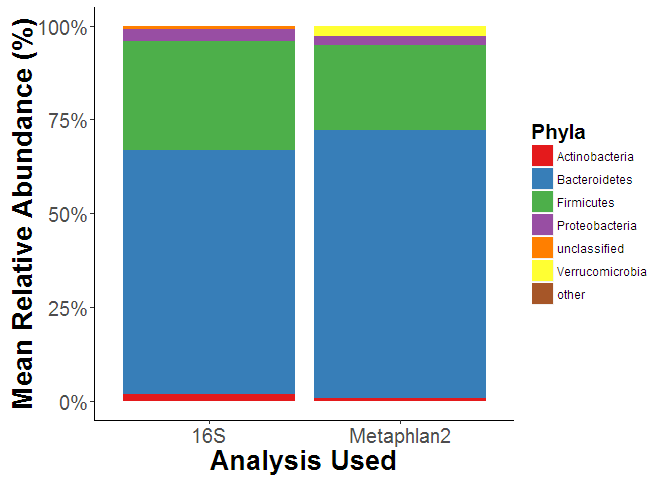
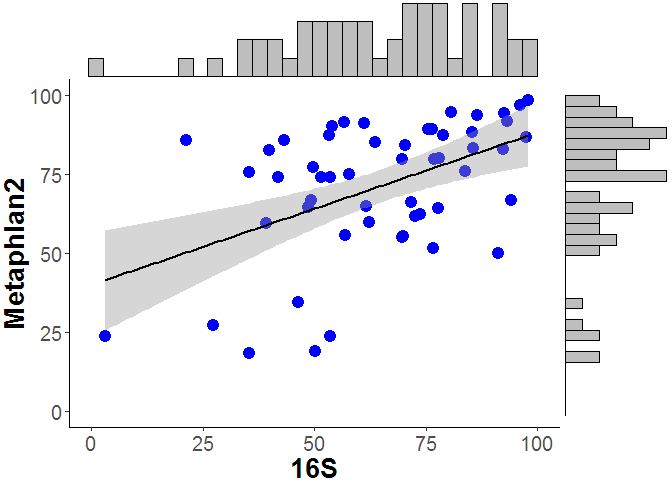
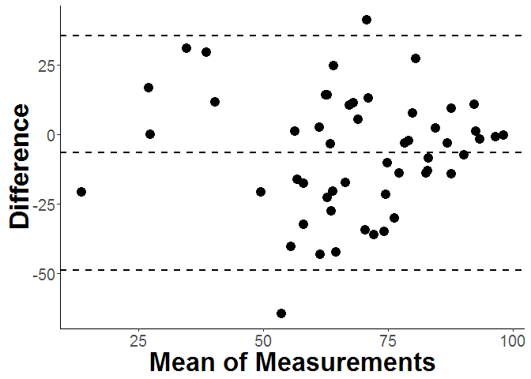

# Bacterial Microbiome and Obesity Meta-analysis Supplemental
Marc Sze  
January 26, 2016  
  

**Figure S1:Comparison of Phyla between 16S Sequencing and Metaphlan2.** 

\

    

**Figure S2: Bacteroidetes Linear Correlation between 16S Sequencing and Metaphlan2.**  Bacteroidetes has the best correlation of all the phyla (P-value = 0.0002277, R^2^ = 0.2358). The histogram for the 16S samples are on the x-axis while the histogram for Metaphlan2 is on the y-axis.

\

    

**Figure S3: Bland-Altman plot of Bacteroidetes measurements for Metaphlan2 and 16S sequencing.**

\

