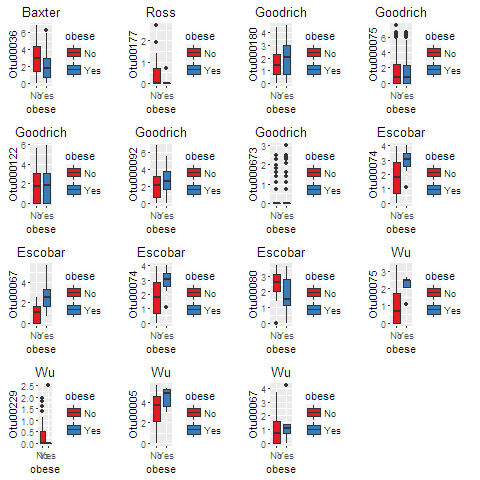
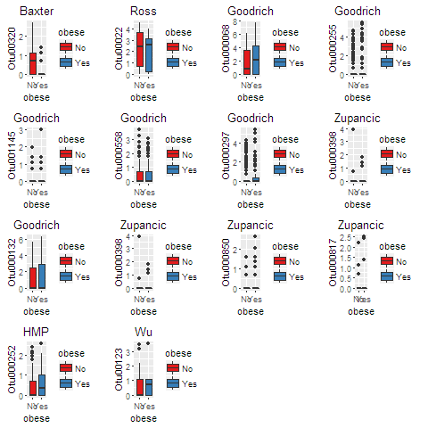

<br><br>


###In-Depth Overview of Search Strategy:

The inital search strategy included looking for all papers that initially fit under the below NCBI PubMed advanced search criteria.  The terms included in this criteria were that the manuscript had to have "Bacterial Microbiome" and "Obesity, BMI, bmi, obesity" in their manuscript criteria, it was not published more than 10 years ago, they were not review articles, and it contained research on humans only.  The below formula when put into PubMed should recapitulate our initial search on the website.

```{bash, eval=FALSE}
(((((((((Bacterial Microbiome) AND (Obesity or bmi or body mass index or BMI or obesity) AND "last 10 years"[PDat] AND Humans[Mesh])) NOT review[ptyp]) AND "last 10 years"[PDat] AND Humans[Mesh])) AND "last 10 years"[PDat] AND Humans[Mesh])) AND "last 10 years"[PDat] AND Humans[Mesh])
```

This search yielded a total of 187 manuscripts.  From two previous other reviews of obesity and the bacterial microbiome along with knowledge of two other published papers that investigated obesity but were missed by the database search we obtained a total of 7 more articles.  We also had access to normal healthy individuals from an unpublished dataset.  This brought our total number of records to 196.  

From this total we browsed abstracts for mention of stool or feces examination, that did not involve children, was not a clinical trial for probiotics or other diet related treatments, did not only have participants with inflammatory bowel disease, the articles were in English, did not only use PCR, qPCR, or RT-PCR only for their analysis, and sequecning that used only clone libraries.  This ultimately excluded all but a total of 11 studies.

From this total of 12 studies the full text was reviewed for whether or not sequencing data was publicly available, BMI information (either categorical or continuous) was available in a supplement or, if it was not available, whether authors upon contact were willing to share this information or direct us to repositories that stored this specific information.  One study was excluded [@yatsunenko_human_2012] because it contained children and their sequencing of the 16S rRNA gene involved amplicons of only 100bp in length.  They also did not have obesity as part of their results in the actual published manuscript.  The second study was excluded because they did not have BMI information available and when contacted the authors never returned any correspondance [@zeevi_personalized_2015].  A thrid study was excluded since it did not use 16S rRNA gene sequencing for their bacterial microbiome analysis [@arumugam_enterotypes_2011]  

Once these 3 studies were excluded there was a total of 9 studies in the qualitative synthesis of the analysis.  Because we decided a prioi to use the standard definition for BMI group classification one study from this ten did not have any individuals who were obese by this criteria [@nam_comparative_2011] and was excluded from the final quantitative synthesis and analysis.  

*Inclusion Criteria:*

* Contains mention of Bacterial Microbiome and Obesity
* BMI, bmi, or obesity could be referenced instead of Obesity
* Not published more than 10 years ago
* Research on Humans only
* At least one specific result examining obesity and a bacterial microbiome measure
* Participants did not have Inflammatory Bowel Disease or Cancer
* Greater than 100bp single or dual end reads for 16S Sequencing
* DNA obtained from stool or feces

*Exclusion Criteria:*

* PCR, qPCR, metagenomic sequencing, or RT-PCR used as main analysis Tool
* TRFLP or clone sequencing used to asses the bacterial community
* Utilization of 100bp or less single end reads for sequencing
* Sequencing Data not publicly available for download
* BMI not available and authors do not return correspondance
* Samples were not stool or feces
* Study contained children
* Study was a review


###Supplemental Results:

\


**Figure S1: Boxplots of All Clostridiales OTUs Important for Non-Obese and Obese Classification.** A total of 6/8 studies had at least 1 OTU that was classified to Clostridiales.  However, overall there was a wide range in direction both between studies and within studies.


\


**Figure S2: Boxplots of All Lachnospiraceae OTUs Important for Non-Obese and Obese Classification.** A total of 6/8 studies had at least 1 OTU that was classified to Lachnospiraceae.  However, overall there was a wide range in direction both between studies and within studies.


\

**Figure S3: Boxplots of All Ruminococcaceae OTUs Important for Non-Obese and Obese Classification.** A total of 7/8 studies had at least 1 OTU that was classified to Ruminococcaceae  However, overall there was a wide range in direction both between studies and within studies.


**Table 1. Summary of BLAST alignment of Representative OTU for Clostridiales, Lachnospiraceae, and Ruminococcaceae classification OTUs**  

```{r Table_S1, echo=FALSE, message=FALSE, warning=FALSE}

library(knitr)

Study <- c("Wu", "Turnbaugh", "Ross", "Escobar", "Zupancic", "Baxter", "Goodrich", "HMP")
VariableRegion <- c("V1-V2", "V2", "V1-V3", "V1-V3", "V1-V3", "V4", "V4", "V3-V5")
ClosMostPrev <- c("OTU191:3 Clostridium", "None", "OTU102:8 Ruminococcus", "None", "OTU322:3 Parvimonas | OTU62:3 Parvimonas | OTU256:4 Clostridium", "OTU479:4 Anaerostipes", "OTU287:5 Clostridium | OTU662:8 Clostridium | OTU145:6 Clostridium | OTU244:3 Clostridium | OTU442:4 Clostridium", "OTU293:7 Clostridium") 
ClostHighMatch <- c("Anaerovorax odorimutans(81|95)", "None", "Ruminococcus champanellensis(100|100)", "None", "OTU322:Eubacterium hallii(92|100) | OTU62:Eubacterium hallii(92|99) | OTU256:Romboutsia lituseburensis(92|99)", "Anaerosporbacter mobilis(100|94)", "OTU287:Clostridium fimetarium(100|94) |  OTU662:Ruminiclostridium thermocellum(100|91) | OTU145:Ruminococcus lactaris(100|100) | OTU244:Anaerosporobacter mobilis(100|94) | OTU442:Clostridium propionicum(100|92)", "Anaerobacterium chartisolvens (100|91)")
LachMostPrev <- c("OTU75:6 Clostridium | OTU229:5 Peptostreptococcus | OTU5: 4 Blautia", "OTU318:", "OTU177:3 Roseburia", "OTU67:6 Eubacterium | OTU74:5 Blautia | OTU80:4 Blautia", "None", "OTU36:8 Clostridium", "OTU180:4 Clostridium | OTU75: 5 Clostridium | OTU122:5 Roseburia | OTU92:8 Clostridium | OTU673:7 Clostridium", "None")
LachHighMatch <- c("Clostridium bolteae(100|96)", "", "Clostridium Spp(100|98)", "OTU67:Dorea formicigenerans(100|96) | OTU74:Blautia luti(100|96) | OTU80:Blautia producta(100|93)", "None", "Lachnobacterium bovis(100|96)", "OTU180:Hungatella effluvii(100|95) | OTU75:Ruminococcus gnavus(100|100) | OTU122:Eubacterium ramulus(100|96) | OTU92:Fusicatenibacter saccharivorans(100|94) | OTU673:Bacteroides xylanolyticus(92|97) | OTU523:Eubacterium rectale(100|97)", "None")
RumiMostPrev <- c("OTU123:4 Clostridium", "OTU30:", "OTU22:3 Oscillibacter", "None", "OTU398:3 Eubacterium | OTU850:3 Ethanoligenens | OTU817:8 Ruminococcus", "OTU320:4 Clostridium", "OTU68:5 Ruminococcus | OTU255:3 Blautia | OTU1145:3 Ethanoligenens | OTU558:8 Ruminococcus | OTU297:3 Oscillibacter | OTU6:4 Clostridium | OTU132:2 Ruminoclostridium", "OTU252:10 Clostridium")
RumiHighMatch <- c("Anaerotruncus colihominis(85|95)", "", "Oscillibacter Spp(100|97)", "None", "OTU398:Oscillibacter valericigene(77|96) | OTU850:Papillibacter cinnamivorans(90|91) | OTU817:Ruminococcus callidus(91|95)", "Sporobacter termitidis(100|94)", "OTU68:Acetanaerobacterium elongatum(100|89) | OTU255:Pseudoflaconifractor capillosus(100|91) | OTU1145:Subdoligranulum variable(100|95) | OTU558:Ruminococcus champanellensis(92|98) | OTU297:Flavonifractor plautii(100|95) | OTU6:Oscillibacter valericigenes(100|93) | OTU132:Intestinimonas butyriciproducens(100|92)", "Clostridium Spp(100|97)")


table1 <- cbind(Study, VariableRegion, ClosMostPrev, ClostHighMatch, LachMostPrev, LachHighMatch, RumiMostPrev, RumiHighMatch)
colnames(table1) <- c("Study", "Hypervariable Region", "Clostridiales OTU Most Prevalent Match", "Clostridiales OTU Highest Match (Query Cover|Identity)", "Lachnospiraceae OTU Most Prevalent Match", "Lachnospiraceae OTU Highest Match (Query Cover|Identity)", "Ruminococcaceae OTU Most Prevalent Match", "Ruminococcaceae OTU Highest Match (Query Cover|Identity)")

kable(table1, format = "markdown", align = 'c', padding = 2)
```


**Table S2. Top Sequence Similarity by Variable Region Based on the Representative OTU for Clostridiales, Lachnospiraceae, and Ruminococcaceae**  

```{r Table_S2, echo=FALSE, message=FALSE, warning=FALSE}

VariableRegion <- c("V1-V2 vs V2", "V1-V3", "V4")

TopHitClos <- c("None", "45.2 | 45.2 | 46.5", "60.9 | 60.9 | 32.8")
AverageClos <- c("None", "34.6 | 34.6 | 59.4", "58.9 | 58.9 | 33.2")
TopHitLachno <- c("TBC", "40.7 | 40.7 | 50", "61.3 | 61.3 | 32.8")
AverageLachno <- c("TBC", "37.9 | 37.9 | 52.1", "59.4 | 59.4 | 33.1")
TopHitRumi <- c("TBC", "15.5 | 15.5 | 84.1", "60.5 | 60.5 | 32.8")
AverageRumi <- c("TBC", "15.2 | 15.2 | 84.1", "57.5 | 57.5 | 33.2")

table2 <- cbind(VariableRegion, TopHitClos, AverageClos, TopHitLachno, AverageLachno, TopHitRumi, AverageRumi)
colnames(table2) <- c("Variable Region", "Top Similarity Colstridiales (Id | Sim | Gaps)", "Average Similarity Colstridiales (Id | Sim | Gaps)", "Top Similarity Lachnospiraceae (Id | Sim | Gaps)", "Average Similarity Lachnospiraceae (Id | Sim | Gaps)", "Top Similarity Ruminococcaceae (Id | Sim | Gaps)", "Average Similarity Ruminococcaceae (Id | Sim | Gaps)")

kable(table2, format = "markdown", align = 'c', padding = 2)

```


*******
##### References:

