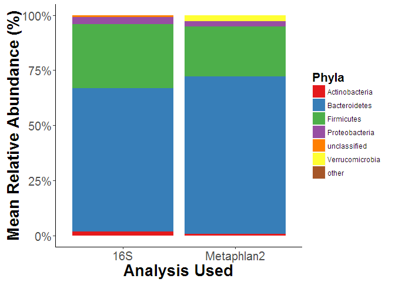
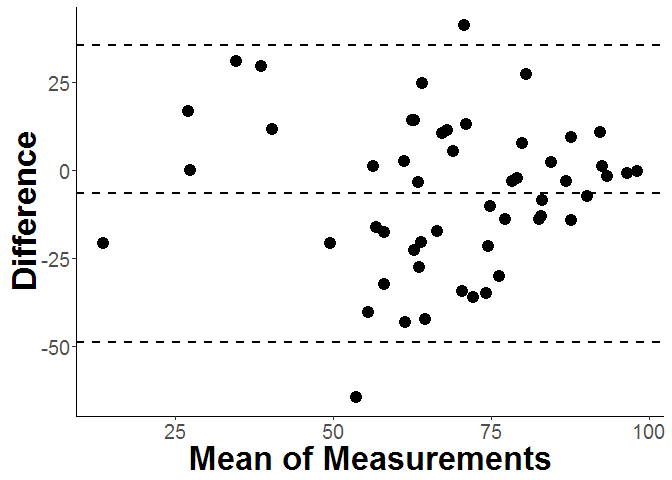

# Bacterial Microbiome and Obesity Meta-analysis Supplemental
Marc Sze  
January 26, 2016  
<br><br>


**In-Depth Overview of Search Strategy:**

The inital search strategy included looking for all papers that initially fit under the below NCBI PubMed advanced search criteria.  The terms included in this criteria were that the manuscript had to have "Bacterial Microbiome" and "Obesity, BMI, bmi, obesity" in their manuscript criteria, it was not published more than 10 years ago, they were not review articles, and it contained research on humans only.  The below formula when put into PubMed should recapitulate our initial search on the website.


```bash
(((((((((Bacterial Microbiome) AND (Obesity or bmi or body mass index or BMI or obesity) AND "last 10 years"[PDat] AND Humans[Mesh])) NOT review[ptyp]) AND "last 10 years"[PDat] AND Humans[Mesh])) AND "last 10 years"[PDat] AND Humans[Mesh])) AND "last 10 years"[PDat] AND Humans[Mesh])
```

This search yielded a total of 187 manuscripts.  From two previous other reviews of obesity and the bacterial microbiome along with knowledge of two other published papers that investigated obesity but were missed by the database search we obtained a total of 7 more articles.  We also had access to normal healthy individuals from an unpublished dataset.  This brought our total number of records to 196.  

From this total we browsed abstracts for mention of stool or feces examination, that did not involve children, was not a clinical trial for probiotics or other diet related treatments, did not only have participants with inflammatory bowel disease, the articles were in English, did not only use PCR, qPCR, or RT-PCR only for their analysis, and sequecning that used only clone libraries.  This ultimately excluded all but a total of 11 studies.

From this total of 12 studies the full text was reviewed for whether or not sequencing data was publicly available, BMI information (either categorical or continuous) was available in a supplement or, if it was not available, whether authors upon contact were willing to share this information or direct us to repositories that stored this specific information.  One study was excluded [@yatsunenko_human_2012] because it contained children and their sequencing of the 16S rRNA gene involved amplicons of only 100bp in length.  They also did not have obesity as part of their results in the actual published manuscript.  The second study was excluded because they did not have BMI information available and when contacted the authors never returned any correspondance [@zeevi_personalized_2015].  

This included a total of 10 studies in the qualitative synthesis of the analysis.  Because we decided a prioi to use the standard definition for BMI group classification one study from this ten did not have any individuals who were obese by this criteria [@nam_comparative_2011] and was excluded from the final quantitative synthesis and analysis.  

*Inclusion Criteria:*

* Contains mention of Bacterial Microbiome and Obesity
* BMI, bmi, or obesity could be referenced instead of Obesity
* Not published more than 10 years ago
* Research on Humans only
* At least one specific result examining obesity and a bacterial microbiome measure
* Participants did not have Inflammatory Bowel Disease or Cancer
* Greater than 100bp single or dual end reads for 16S Sequencing
* DNA obtained from stool or feces

*Exclusion Criteria:*

* PCR, qPCR, or RT-PCR used as main analysis Tool
* TRFLP or clone sequencing used to asses the bacterial community
* Utilization of 100bp or less single end reads for sequencing
* Sequencing Data not publicly available for download
* BMI not available and authors do not return correspondance
* Samples were not stool or feces
* Study contained children
* Study was a review


**A Comparison of 16S Amplicon Sequencing and Metaphlan2:**

\

**Figure S1:Comparison of Phyla between 16S Sequencing and Metaphlan2.** 


\

**Figure S2: Bacteroidetes Linear Correlation between 16S Sequencing and Metaphlan2.**  Bacteroidetes has the best correlation of all the phyla (P-value = 0.0002277, R^2^ = 0.2358). The histogram for the 16S samples are on the x-axis while the histogram for Metaphlan2 is on the y-axis.


\

**Figure S3: Bland-Altman plot of Bacteroidetes measurements for Metaphlan2 and 16S sequencing.**


*******
##### References:

