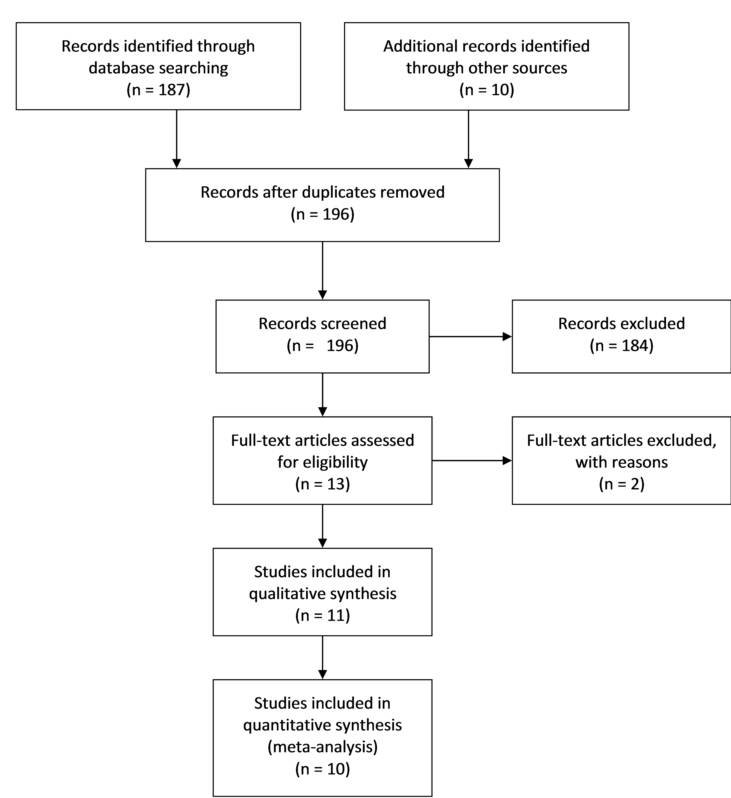

Marc A Sze<sup>1</sup> and Patrick D Schloss<sup>1</sup>


<sup>1</sup> Department of Microbiology and Immunology, University of Michigan, Ann Arbor, MI, USA  
<br>
<br>
<br>
<br>
<br>
<br>
Corresponding author: Patrick D Schloss  
*Current Address:*  
1520A Medical Science Research Building I
1500 W. Medical Center Dr.
Ann Arbor, MI  
USA 48109-5620  
Email: pschloss@umich.edu  
Phone: 734-647-5801    
<br>
<br>
**Contributions:** MAS (planned, designed, and performed experiments, completed data analysis, wrote first draft), PDS (planned and designed the study, data interpretation, and edited subsequent drafts).
<br>
**Running Title:** microbiome and Obesity
<br>

```{r Loading_data_tables, echo=FALSE, message=FALSE, warning=FALSE}

alpha_tests.summary <- read.table("../data/process/alpha_tests.summary", header=T)
alpha_composite.summary <- read.table("../data/process/alpha_composite.summary")
alpha_power.obs <- read.table("../data/process/alpha_power.observed", 
                              header = T, row.names = 1)
alpha_power.predicted <- read.table("../data/process/alpha_power.predicted", 
                                    header = T)
alpha.data.ALL <- read.table("../data/process/alpha.data", header = T)
alpha_effectSize <- read.table("../data/process/alpha_EffectSize.summary")

beta_tests.summary <- read.table("../data/process/beta_tests.summary", 
                                 header=T, row.names = 1)
rand_forest.genus.roc_data <- read.table("../data/process/random_forest.genus.roc_data", header=T)

rand_forest.genus.summary <- read.table("../data/process/random_forest.genus.summary", 
                                        header = T, row.names = 1)

rand_forest.genus.train_test <- 
  read.table("../data/process/random_forest.genus.train_test", header = T)

rand_forest.otu.roc_data <- 
  read.table("../data/process/random_forest.otu.roc_data", header = T)

rand_forest.otu.summary <- 
  read.table("../data/process/random_forest.otu.summary", 
             header = T, row.names = 1)

RR_composite <- read.table("../data/process/relative_risk.composite", header = T)
RR_summary <- read.table("../data/process/relative_risk.summary", header = T)
RR_pow.obs <- read.table("../data/process/rr_power.observed", 
                         header = T, row.names = 1)
RR_pow.pred <- read.table("../data/process/rr_power.predicted", header = T)

shannond <- (mean(alpha.data.ALL[which(alpha.data.ALL$obese == FALSE), ]$shannon)-mean(alpha.data.ALL[which(alpha.data.ALL$obese == TRUE), ]$shannon))/sd(alpha.data.ALL$shannon)

bf_ratiod <- (mean(alpha.data.ALL[which(alpha.data.ALL$obese == FALSE), ]$bf_ratio)-mean(alpha.data.ALL[which(alpha.data.ALL$obese == TRUE), ]$bf_ratio))/sd(alpha.data.ALL$bf_ratio)


```

```{r install_needed_packages, echo=FALSE, message=FALSE, warning=FALSE}
deps = c("knitr","vegan","epiR","AUCRF","metafor","ggplot2", "plyr", "reshape2", "RColorBrewer", "scales", "gridExtra", "pwr", "statmod");
for (dep in deps){
  if (dep %in% installed.packages()[,"Package"] == FALSE){
    install.packages(as.character(dep), quiet=TRUE);
  }
  library(dep, verbose=FALSE, character.only=TRUE)
}

```


*******
## Abstract
**Rationale:** The hypothesis that changes in the microbiome are associated with obesity has been widely accepted. However, two recent studies re-analyzed published data and found that when the datasets were analyzed independently they could not support the hypothesis. In this meta analysis, we retested the hypothesis by increasing the number of data sets examined and investigating the effect of pooling the results across the individual datasets.

**Methods:** To identify datasets that we included in the meta analysis we followed the Preferred Reporting Items for Systematic Reviews and Meta-Analyses (PRISMA) guidelines we winnowed an initial set of 196 studies that tested the microbiome-obesity association hypothesis down to 8 studies that fit our criteria. We applied three analysis pipelines to the data from each study. First, we tested the association between community structure and diversity and the Bacteroides to Firmicutes ratio (B/F) with the subjects' body mass index (BMI) treated as a continuous or categorical value. We also used the random forest machine learning algorithm to identify community features that would allow us to to predict whether a person was obese based on either genus or OTU level. Second, we pooled the relative risk (RR) ratio of being obese based on characteristics of the microbiome for each study and tested for an association between RR and community diversity and B/F. Finally, we normalized the community diversity and B/F values within each dataset and pooled the data to test for an association with obesity.

**Results:** When we considered each dataset in isolation, there were no significant differences (P > 0.05) in B/F between non-obese and obese individuals. A total of `r length(rownames(alpha_tests.summary[which(alpha_tests.summary$p.value < 0.05 & alpha_tests.summary$metric != "bacteroidetes"), ]))` diversity measurements  were found to be significantly different between non-obese and obese indivdiuals (P < 0.05) (Shannon Diversity (n=`r length(rownames(alpha_tests.summary[which(alpha_tests.summary$p.value < 0.05 & alpha_tests.summary$metric == "shannon"), ]))`), observed richness (n=`r length(rownames(alpha_tests.summary[which(alpha_tests.summary$p.value < 0.05 & alpha_tests.summary$metric == "sobs"), ]))`), and evenness (n=`r length(rownames(alpha_tests.summary[which(alpha_tests.summary$p.value < 0.05 & alpha_tests.summary$metric == "shannoneven"), ]))`)). With individual studies, random forest was effective at identifying features within the datasets for differentiating between non-obese and obese individuals for both the genus (mean AUC: `r format(round(mean(rand_forest.genus.summary$auc), 2), nsmall=2)`; s.d.=`r format(round(sd(rand_forest.genus.summary$auc), 2), nsmall=2)`) and OTU (mean AUC: `r format(round(mean(rand_forest.otu.summary$auc), 2), nsmall=2)`; s.d.=`r format(round(sd(rand_forest.otu.summary$auc), 2), nsmall=2)`) level, and there was no significant difference between the studies (bonferroni adjusted P-value > 0.05). When we pooled the results across studies, there was a significant difference in RR of obesity based on Shannon diversity (RR = `r format(round(RR_composite['shannon', 'rr'],2), nsmall=2)`, CI = `r format(round(RR_composite['shannon', 'ci_lb'], 2), nsmall=2)`-`r format(round(RR_composite['shannon', 'ci_ub'], 2), nsmall=2)`, P-value = `r format(round(RR_composite['shannon', 'p_value'], 3), nsmall=3)`) but not for B/F ratio (RR = `r format(round(RR_composite['bf_ratio', 'rr'],2), nsmall=2)`, CI = `r format(round(RR_composite['bf_ratio', 'ci_lb'], 2), nsmall=2)`-`r format(round(RR_composite['bf_ratio', 'ci_ub'], 2), nsmall=2)`, P-value = `r format(round(RR_composite['bf_ratio', 'p_value'], 3), nsmall=3)`). When we used a linear mixed-effect model correcting for study there was a significant difference in Shannon diversity (P-value = `r format(round(alpha_composite.summary['shannon', 'composite_p'], 4), nsmall=4)`) but no such significant difference was found for the B/F ratio (P-value = `r format(round(alpha_composite.summary['bf_ratio', 'composite_p'], 2), nsmall=2)`) between non-obese and obese individuals. Finally, when completing both power and sample size calculations and simulations we found that most of the studies examined were not sufficiently powered to detect differences in any of the measurements used.

**Conclusion:** We show that by pooling the results of many individual studies we can test the generalizability of the microbiome. Our meta-analysis provides support for the null hypothesis that there is no difference between non-obese and obese individuals in Shannon diversity and B/F ratio, that the effect sizes are small, and that a very large number of indivdiuals would have to be tested to reach sufficient study power.


\newpage

## Introduction

Obesity is a growing worldwide health concern with approximately 20% of the youth (aged 2-19) in the United States classified as either overweight or obese [@ogden_prevalence_2014]. This number increases to approximately 35% in adults (aged 20 or older) and these statistics have seen little change since 2003 [@ogden_prevalence_2014]. Traditionally the body mass index (BMI) has been used as the traditional method of classifying individuals as non-obese or obese [@lichtash_body_2013]. Recently, there has been increased interest in the role of the microbiome in modulating obesity [@brahe_can_2016; @dror_microbiota_2016]. If the microbiome does affect obesity status, then manipulating the microbiome could have a significant role in the future treatment of obesity and in helping to stem the current epidemic.

There has been a continuous stream of studies that report observing a link between the composition of microbiome and obesity. The first such study used genetically obese mice and observed that obese mice had a lower Bacteroidetes and higher Firmicutes than lean mice (lower B/F ratio associated with obesity) [@ley_obesity_2005]. Translation of this result to humans by the same researchers did not observe this effect, but did find that obese individuals had a lower diversity than lean individuals [@turnbaugh_core_2009]. Since the publication of these studies there have been a steady stream of publications on the microbiome with associated BMI data but without clear explicit mention of any significant correlations between the microbiome and obesity [@ross_16s_2015; @zupancic_analysis_2012; @nam_comparative_2011; @arumugam_enterotypes_2011; @goodrich_human_2014; @wu_linking_2011; @escobar_gut_2014]. Two re-analysis studies interrogated previously published microbiome and obesity data and concluded that the previously reported differences in community diversity and B/F among non-obese and obese individuals could not be generalized [@walters_meta-analyses_2014; @finucane_taxonomic_2014].

One critique of these re-analysis studies is that they did not aggregate the results across studies to increase the effective sample size. It is possible that there are small associations within each study that would not be significant because the studies lacked sufficient statistical power. The purpose of this study was to perform a meta-analysis of the association between differences in the microbiome and obesity status by analyzing and applying a more systematic and synthetic approach than was used previously. Furthermore, we sought to provide additional clarity on the possible relationship between community diversity, B/F, and community composition and obesity status and the ability to detect significant differences in these variables if they were actually present.


## Methods

***Literature Review and Study Inclusion***
We followed the Preferred Reporting Items for Systematic Reviews and Meta-Analyses (PRISMA) guidelines to identify studies to include in our meta-analysis [@moher_preferred_2010]. A detailed description of our selection process and the exact search terms are provided in the Supplement [Figure 1]. Briefly, we searched PubMed for original research studies that involved studying obesity and the human microbiome. The initial search yielded 187 studies. We identified nine additional studies that were not designed to explicitly test for an association between the microbiome and obesity. We then manually curated the 196 studies to select those studies that included BMI and sequence data. This yielded 10 eligible studies. An additional study was removed from our analysis because no individuals in the study had a BMI over 30. Among the final 9 studies, 3 were from identified from our PubMed search [@turnbaugh_core_2009; @zupancic_analysis_2012; @escobar_gut_2014], 5 were originally identified from the 9 studies that did not explicitly investigate obesity but included BMI data [@ross_16s_2015; @goodrich_human_2014; @wu_linking_2011; @human_microbiome_project_consortium_structure_2012], and one dataset was used (Baxter) because at the time of our analysis it was unpublished and enabled us to mitigate against publication biases associated with the bacterial microbiome and obesity. The nine studies are summarized in Tables 1 and 2.


***Sequence Analysis Pipeline***
All sequence data were publicly available and were downloaded from the NCBI Sequence Read Archive, the European Nucleotide Archive, or the investigators' personal website (https://gordonlab.wustl.edu/TurnbaughSE\_10\_09/STM\_2009.html). The nine studies used 454 [@turnbaugh_core_2009; @zupancic_analysis_2012; @ross_16s_2015; @escobar_gut_2014; @wu_linking_2011; @human_microbiome_project_consortium_structure_2012] or Illumina sequencing [@goodrich_human_2014; Baxter]. All of these studies used amplification-based 16S rRNA gene sequencing. Among the studies that sequenced the 16S rRNA gene, the researchers targeted the V1-V2  [@wu_linking_2011], V1-V3 [@ross_16s_2015; @escobar_gut_2014; @zupancic_analysis_2012], V3-V5 [@human_microbiome_project_consortium_structure_2012], and V4 [@goodrich_human_2014] regions. For those studies where multiple regions were sequenced,  we selected the region that corresponded to the largest number of subjects [@turnbaugh_core_2009; @human_microbiome_project_consortium_structure_2012]. We processed the 16S rRNA gene sequence data as described in the original studies. The taxonomic data from the metagenomic shotgun sequence data were obtained using Metaphlan2 [@truong_metaphlan2_2015]. A detailed and reproducible description of how the data were processed can be found at https://github.com/SchlossLab/Sze_ObesityMicrobiomeMeta_PeerJ_2016/.


***Data Analysis***
We performed the analysis using R (`r paste0(R.Version()$major,'.', R.Version()$minor)`). We split the overall analysis into three general strategies. In the first strategy we followed the approach employed by Finucane et al [-@finucane_taxonomic_2014] and Walters et al [-@walters_meta-analyses_2014] where each study was re-analyzed separately to identify associations between BMI and the relative abundance of Bacteroidetes and Firmicutes, the ratio of Bacteroidetes and Firmicutes relative abundances (B/F), Shannon diversity, and number of OTUs. A two-tailed Wilcoxon test was performed for comparison for non-obese and obese individuals. We also measured the Spearman correlation coefficient between each metric and the actual BMI value. Next, we compared the community structure from non-obese and obese individuals using PERMANOVA analysis of Bray-Curtis distance matrices. This analysis was performed using the vegan R package. Finally, we used the AUCRF (v1.1) R package to implement a Random Forest analysis to identify the best OTUs and alpha-diversity metrics for distinguish non-obese and obese individuals.  To generate Receiver Operator Characteristic (ROC) curves we used the pROC (v1.8) R package.  A Bonferroni-adjusted p-value was used to assess differences between each study.

In the second strategy, we pooled the relative risk (RR) values for each study. For each study we partitioned the subjects into a low or high group depending on whether their diversity or B/F was below or above the median value for the study. The RR was then calculated as the ratio of the number of obese individuals in the low group to the number of obese individuals in the high group. We then performed a Fisher exact-test to test whether the RR was significantly different from 1.0 using the epiR (v0.9-6.9) and metafor (v1.9-8) packages. Finally, we assessed the potential publication bias in the diversity and B/F analyses using a funnel plot.

In the third strategy, we normalized the diversity and B/F data within each study and pooled the normalized data across studies. We applied a Z-score normalization to the Shannon diversity data and log-transformed B/F data within each study to have a mean of zero and standard deviation of one. We then pooled Z-scores across studies and used a two-tailed T-test on the values to test for a significant difference in Z-scores among non-obese and obese individuals.

In the final component of the analysis we performed power and sample number simulations for different effect sizes for each study.  This was completed for all the different components measured as part of first strategy.  We also calculated the actual sample size needed based on the effect size of each individual study.  To complete this analysis we used a combination of the pwr (v1.1-3) R package and base R functions.   


## Results

***Separate Analysis***
We used the categorical variable of obese or non-obese to analyze each data set separately for significant correlations to Bacteroidetes, Firmicutes, Bacteroidetes/Firmicutes (B/F) ratio, Shannon diversity, OTU richness, evenness, and the Bray-Curtis distance matrix which was a similar approach taken by two previous reviews [@walters_meta-analyses_2014; @finucane_taxonomic_2014]. Using a P-value cutoff for significance as less than 0.05 we found a only 1 significant result for OTU richness. There were no significant results for Bacteroidetes, Firmicutes, or the B/F ratio. The full summary of the exact P-values for each respective study and variable tested can be found in table S1 of the online supplement.

Next we investigated how well the OTUs in each study were able to classify obese and non-obese individuals using the random forest algorithm. We found that the average Out Of Bag (OOB) Area Under the Curve (AUC) was `r format(round(mean(rand_forest.genus.summary$auc), 2), nsmall=2)` +/- `r format(round(sd(rand_forest.genus.summary$auc), 2), nsmall=2)` for the genus level analysis and `r format(round(mean(rand_forest.otu.summary$auc), 2), nsmall=2)` +/- `r format(round(sd(rand_forest.otu.summary$auc), 2), nsmall=2)` for the OTU level analysis.  We found that the range for the total number of variables used for the classification using genus ranged from `r min(rand_forest.genus.summary$k_opt)` (HMP and Wu, et al. study) to `r max(rand_forest.genus.summary$k_opt)` (Goodrich, et al. Study).  For the OTU level the number of variables ranged from `r min(rand_forest.otu.summary$k_opt)` (Wu, et al. study) to `r max(rand_forest.otu.summary$k_opt)` (Goodrich, et al. study). The total number of trees and node size was standardized to 500 and 20 respectively for each data set. Overall there was no significant difference between the ROC curves of each data set (P-value > 0.05, Figure 2).  One aspect we found surprising was that there was very little overlap in the variables used by the random forest algorithm for the classification of obese and non-obese individuals by study. The three most common variables was for an OTU that could be classified to the family Ruminococcaceae (7/8 studies), an OTU that could be classified to the family Lachnospiraceae (6/8 studies), Clostridiales (6/8), Bacteroides (5/8), and Shannon diversity metric (4/8 studies).

Using the top three common taxonomic classifications identified across studies we investigated this further.  Although these taxonomic level classifications showed up commonly across studies, the overall direction and magnitude varied quite a bit depending on the study [Figure S1-3].  Further, when the sequences were BLAST the identifications within each OTU within and between groups varied quite widely with many having relatively poor query coverage and identity [Table S2].  When the sequence identity for each specific variable region was compared using the EMBOSS Needle pairwise sequence alignment (http://www.ebi.ac.uk/Tools/psa/emboss_needle/nucleotide.html) the V4 region had the highest similarity [Table S3] but all had greater than 4% dissimilarity.      


***Classical Pooled Meta-analysis***

We next moved on to the pooled meta-analysis. For the Shannon diversity RR, all studies but Wu, Goodrich, and Turnbaugh had those with a lower Shannon diversity then the median as being higher risk for obesity [Figure 3A]. The pooled analysis showed an increased RR of `r format(round(RR_composite['shannon', 'rr'],2), nsmall=2)` (CI `r format(round(RR_composite['shannon', 'ci_lb'],2), nsmall=2)` - `r format(round(RR_composite['shannon', 'ci_ub'], 2), nsmall=2)`) for obesity in the lower then median Shannon diversity group that was significant (P-value = `r format(round(RR_composite['shannon', 'p_value']), nsmall=2)`). In contrast, when we investigated the B/F ratio RR  the pooled result from all studies showed that there was no significant difference between obese and non-obese individuals (P-value = `r format(round(RR_composite['bf_ratio', 'p_value']), nsmall=2)`) [Figure 3B].  The pooled RR was `r format(round(RR_composite['bf_ratio', 'rr'],2), nsmall=2)` (CI `r format(round(RR_composite['bf_ratio', 'ci_lb'], 2), nsmall=2)` - `r format(round(RR_composite['bf_ratio', 'ci_ub'], 2), nsmall=2)`).  The differences in RR that was observed also do not seem to be related to the variable region chosen [Figure 3].  

We also used a funnel plot to asses the bias of the 9 data sets used in this meta-analysis. From the graph we can observe that there does not seem to be any significant  bias [Figure S4]. Both funnel plots have almost equal number of studies scattered on either side of the estimated true value.


***Linear Mixed-Effect models for Pooled Analysis***

Using the third approach which utilizes a linear mixed-effect model to control for the effect of study on the Shannon diversity  we found that there was a significant difference between the obese and non-obese groups (P-value = `r format(round(alpha_composite.summary['shannon', 'composite_p'], 4), nsmall=4)`) [Figure 5A]. Additionally,  there was also a significant difference in obseverd richness (P-value = `r format(round(alpha_composite.summary['sobs', 'composite_p'], 9), nsmall=9)`).  However, we found that the there was no significant difference in evenness (P-value = `r format(round(alpha_composite.summary['shannoneven', 'composite_p'], 2), nsmall=2)`), Bacteroidetes (P-value = `r format(round(alpha_composite.summary['bacteroidetes', 'composite_p'], 2), nsmall=2)`), Firmicutes (P-value = `r format(round(alpha_composite.summary['firmicutes', 'composite_p'], 2), nsmall=2)`), and B/F ratio (P-value = `r format(round(alpha_composite.summary['bf_ratio', 'composite_p'], 2), nsmall=2)`) using this approach, between obese and non-obese individuals [Figure 5B].


***Power and Sample Size Estimates and Simulations***

For Shannon Diversity the measured difference between both obese and non-obese groups was relatively small [Figure 5A] compared to the B/F ratio [Figure 6A] differences.  When simulating different effect size differences of 1%, 5%, 10%, and 15% we found that many studies would be powered sufficiently to find a 15% difference in Shannon diversity (predicted percent power = `r format(round(mean(alpha_power.predicted[which(alpha_power.predicted$metric == 'shannon' & alpha_power.predicted$effect_size == 0.15), ]$power*100), 2), nsmall=2)`, SD = `r format(round(sd(alpha_power.predicted[which(alpha_power.predicted$metric == 'shannon' & alpha_power.predicted$effect_size == 0.15), ]$power*100), 2), nsmall=2)`) [Figure 5A].  This predicted power was also similar for evenness (`r format(round(mean(alpha_power.predicted[which(alpha_power.predicted$metric == 'shannoneven' & alpha_power.predicted$effect_size == 0.15), ]$power*100), 2), nsmall=2)`, SD = `r format(round(sd(alpha_power.predicted[which(alpha_power.predicted$metric == 'shannoneven' & alpha_power.predicted$effect_size == 0.15), ]$power*100), 2), nsmall=2)`).   However, this was not the case for the B/F ratio (`r format(round(mean(alpha_power.predicted[which(alpha_power.predicted$metric == 'bf_ratio' & alpha_power.predicted$effect_size == 0.15), ]$power*100), 2), nsmall=2)` +/- `r format(round(sd(alpha_power.predicted[which(alpha_power.predicted$metric == 'bf_ratio' & alpha_power.predicted$effect_size == 0.15), ]$power*100), 2), nsmall=2)`%) [Figure 6A] or the other measures that were tested (observed richness, Bacteroidetes, Firmicutes) where even a 15% difference between non-obese and obese groups only resulted in a relatively poor average power between studies.   Looking at the sample sizes showed that on average to detect a 5% difference in Shannon diversity at 80% power between non-obese and obese individuals a total n of `r format(round(mean(alpha_power.predicted[which(alpha_power.predicted$metric == 'shannon' & alpha_power.predicted$effect_size == 0.05), ]$balanced_n*100), 0), nsmall=0)` (SD = `r format(round(sd(alpha_power.predicted[which(alpha_power.predicted$metric == 'shannon' & alpha_power.predicted$effect_size == 0.05), ]$balanced_n*100), 0), nsmall=0)`) would be needed for each group [Figure 5B].  In contrast in order to detect a 5% difference with 80% power in the B/F ratio a sample size of `r format(round(mean(alpha_power.predicted[which(alpha_power.predicted$metric == 'bf_ratio' & alpha_power.predicted$effect_size == 0.05), ]$balanced_n*100), 0), nsmall=0)` (SD = `r format(round(sd(alpha_power.predicted[which(alpha_power.predicted$metric == 'bf_ratio' & alpha_power.predicted$effect_size == 0.05), ]$balanced_n*100), 0), nsmall=0)`) per group [Figure 6B].  A complete breakdown of the power simulations and sample size estimates for the other variables investigated and RR can be found in the online supplement.   

We also investigated if the combined total n for the linear mixed effect model was sufficiently powered.  Using a small (0.2), medium (0.5), and large (0.8) cohen value we estimated the power of the combined data sets as well as the average cohen value from across studies for Shannon Diversity (0.06) and BF ratio (0.01).  For the small effect for combined data power calculation a value of `r format(round(pwr.t2n.test(n1=length(which(alpha.data.ALL$obese == FALSE)), n2=length(which(alpha.data.ALL$obese == TRUE)), d=0.2, sig.level = 0.05, alternative="two.sided")$power*100,2), nsmall=2)`% was found.  For the medium effect for combined data power calculation a value of `r format(round(pwr.t2n.test(n1=length(which(alpha.data.ALL$obese == FALSE)), n2=length(which(alpha.data.ALL$obese == TRUE)), d=0.5, sig.level = 0.05, alternative="two.sided")$power*100,2), nsmall=2)`% was found.  For the large effect for combined data power calculation a value of
`r format(round(pwr.t2n.test(n1=length(which(alpha.data.ALL$obese == FALSE)), n2=length(which(alpha.data.ALL$obese == TRUE)), d=0.8, sig.level = 0.05, alternative="two.sided")$power*100,2), nsmall=2)`% was found.  The average actual cohens d value for Shannon Diversity for all `r length(rownames(beta_tests.summary))` studies of `r format(round(shannond, 2), nsmall=2)` gave a power of `r format(round(pwr.t2n.test(n1=length(which(alpha.data.ALL$obese == FALSE)), n2=length(which(alpha.data.ALL$obese == TRUE)), d=shannond, sig.level = 0.05, alternative="two.sided")$power*100,2), nsmall=2)`%.  Finally, the average actual cohens d value for B/F ratio for all `r length(rownames(beta_tests.summary))` studies of `r format(round(bf_ratiod, 2), nsmall=2)` yieled a power of `r format(round(pwr.t2n.test(n1=length(which(alpha.data.ALL$obese == FALSE)), n2=length(which(alpha.data.ALL$obese == TRUE)), d=bf_ratiod, sig.level = 0.05, alternative="two.sided")$power*100,2), nsmall=2)`%.  


## Discussion:

Our meta-analysis helps to provide a little more clarity to the on going debate of whether or not there are specific microbiome variables that are influenced by obesity. Two previous reviews [@walters_meta-analyses_2014; @finucane_taxonomic_2014] have stated that the data do not support that there is a microbiome difference between non-obese and obese individuals. However, neither of these studies made an attempt to pool the existing data together to try and harness the additional power that this would give. Here we perform an extensive literature review of the existing studies on the microbiome and obesity and perform a meta-analysis on the studies that remained based on our inclusion and exclusion criteria. We analyzed the data using three different approaches and also performed post-hoc power and sample size calculations and simulations. The first approach uses the method taken by the previous reviews [@walters_meta-analyses_2014; @finucane_taxonomic_2014], the second approach takes a meta-analysis approach using RR representation by forest plots and funnel plots, the final approach also takes a meta-analysis approach but uses Z-score normalizations and does not use RR.

Overall, the first approach in this study by and large agrees with the prevous two reviews[@walters_meta-analyses_2014; @finucane_taxonomic_2014], in that for the majority of studies, no significant correlation between the microbiome and obesityy could be observed. Further, even though random forest could identify specific variables with similar taxonomic classifications that resulted in good ROC curves [Figure 1] these variables varied widely by both their actual sequence and directionality.  Similarily, we found that the other two approaches, that used the pooled data approach, was also not able to identify a correlation between measures of the microbiome and obesity [Figure 3 & 4]. For these approaches both Shannon diversity and B/F ratio failed to have a significant correlation to obesity. In order to also assess the amount of our results that could be due to insufficient power we performed power and sample size analysis.  Overall we found that most studies for Shannon Diversity would be powered to find a 15% difference, however, the vast majority of reported effect sizes between studies ranged from `r format(round(min(alpha_effectSize[, 'shannon']), 2), nsmall=2)`-`r format(round(max(alpha_effectSize[, 'shannon']), 2), nsmall=2)` percent.  Although the effect sizes for the BF ratio were larger than that for Shannon Diversity [Figure 5A & 6A] the estimated power remained low.  Additionaly, we would also need a relatively large sample size to be able to detect the actual differences in each study for both Shannon Diversity and B/F ratio [Figure 5B & 6B].  Taken together we believe that this analysis builds on the previous two re-anlaysis and provides additional information as to whether there is a difference between non-obese and obese human individuals with respect to both Shannon diversity and the B/F ratio.    


We do acknowledge that this study does have a few limitations that are worth mentioning. First,  it has been documented that in a number of groups BMI is not a good classification of obesity [@who_expert_consultation_appropriate_2004; @rahman_accuracy_2010]. Of particular note, the asian population has a separate set of guidelines for obesity [@who_expert_consultation_appropriate_2004]. Although the asain population in the studies analyzed are very small [Table 1] it is possible that this may contribute to some of the noise in the data. However, it is important to keep in mind that for these measures, specifically the RR, there does not seem to be any study bias due to studies having more ethnic diversity [Figure 4]. Additionally, we are also limited in our BMI classifications by what the previous studies published and performed. In general, not enough studies have been done to investigate the microbiome in the context of other markers for obesity or on different ethnicities to be able to perform the analysis that we did. Thus as more specific studies are published that address ethnicity and studies on the microbiome that use better markers of obesity are completed it is entirely possible that the noise associated with these measurements will decrease.    

Second, although we make attempts to normalize the data for the pooled analysis so that we can compare the microbiome across studies it is possible that the different variable regions sampled, sequencing machines used, and the quality of the output data could have an impact on the overall conclusions reached.  To help mitigate some of these problems we analyzed each data set separately and processed all samples through a uniform pipeline in an attempt to mitigate some of the variation that might occur due to sequence processing.  It should also be noted that we also do not see any specific bias in the forest plots [Figure 3] based on hypervariable region.  Further many of the studies show very similar actual effect sizes for Shannon Diversity difference between non-obese and obese individuals.  However, even with all these precautions and safety checks we do realize that it may not be possible to compare these studies together and that further studies need to be completed to verify the observations made in this report.  

Third, although we may not have detected a signal between non-obese and obese individuals our results indicate that we may not have been sufficiently powered to do so. However, taking both the sample size calculations and power calculations together would indicate that if there is a true difference to be found between non-obese and obese individuals this difference would be very small.  Additionally, due to the very small signal another important question would be whether or not this difference is truly biologically meaningful.

Fourth, although the ROC curves for each study were relatively good there was very little actual overlap between studies based on sequence similarity and directionality.  This would suggest that within each study classification of obese and non-obese is relatively strong but not generalizable across studies.  This might indicate an ancestry, ethnicity, or a specific environmental effect such as diet difference between study populations that might cause this dissimilarity.  It is also possible that the random forest model overfit the data making it less generalizable across studies.    

Although we failed to find an effect it is not realistic to necessarily state that there is no microbiome impact on obesity.  There is a large body of very strong evidence in mice on the effect the microbiome has on obesity [@turnbaugh_effect_2009; @koren_host_2012].  It is not possible to discount these findings and it may be the case that in humans there is just too many other variables and factors that effect the microbiome which makes the signal to hard to detect in a cross sectional manner.  Some well designed studies in humans and diet, in the pasat, have shown that the noise inherent to microbiome studies can be overcome with very careful attention made to controlling the study conditions [@ley_microbial_2006].   

Overall, this study provides a reasonable follow up to the two previous re-analysis studies to assess the correlation between the microbiome and obesity. In doing so we believe that we have provided evidence that if there is an effect size present it is small and will take many more studies and samples to be analyzed to confirm a difference between non-obese and obese individuals.


## Acknowledgements

The authors would like to thank Nielson Baxter and Shawn Whitefield for their suggestions on the manuscript. Finally, we would like to thank all the authors who have made there data publicly available.  Without this initial forethought studies such as these would not be possible.


\newpage

## Tables

**Table 1. Summary Demographics of Individuals used in the Meta-analysis.**
```{r Table_1, echo=FALSE, message=FALSE, warning=FALSE}

table1 <- read.table("../results/tables/table1.demographics", header=T)

colnames(table1) <- c("Study", "Age (SD)", "Sex (F|M)", "European Ancestry (%)", 
                      "Obese (No|Yes)", "BMI (SD)", "Min BMI","Max BMI")

kable(table1, format = "markdown", align = 'c', padding = 2)


```

* For Turnbaugh only BMI group information was provided and only an age range was given.

\newpage

**Table 2. Summary of Important Study Characteristics.**

```{r Table_2, echo=FALSE, message=FALSE, warning=FALSE}
# Old order
#Study <- c("Baxter", "Ross", "Goodrich", "Escobar", "Zupancic", "HMP", "Wu", #"Turnbaugh")

Study <- as.character(table1$Study)
  #New Order
  #baxter, escobar, hmp, ross, schubert, turnbaugh, wu, zupancic, goodrich, zeevi

Type <- c("Observational", "Observational", "Observational", "Observational", "Observational", "Observational", "Observational", "Observational")

Population <- c("Adults without Cancer from Texas, Ontario, Michigan, Massachusetts", "Healthy adults from Columbia", "Healthy Adults from Pennsylvania", "Hispanic adults with and without type 2 diabetes from Texas
", "Nondiarrheal indivdiuals without infection history", "Adult twins and mothers from Missouri", "Healthy Adults from Texas and Missouri", "Amish Adults with and without metabolic syndrome from Pennsylvania", "Adult twins and mothers from the United Kingdom")

Published <- c("Yes", "Yes", "Yes", "Yes", "Yes", "Yes", "Yes","Yes", "Yes")

Outcomes <- c("Did not investigate control populations for relationship with BMI", "Firmicutes less abundant at higher BMI", "No significant correlations", "Mentions obesity, no specific correlations made though", "Did not investigate control populations for relationship with BMI", "Unweighted UniFrac Correlation with BMI", "Decrease diversity, Bacteroidetes, and Actinobacteria correlated with increased BMI ", "Bacteroidetes/Firmicutes ratio adjusted BMI correlation", "Christensenellaceae higher in low BMI individuals. No other correlations found.")

table2 <- cbind(Study, Type, Population, Published, Outcomes)

colnames(table2) <- c("Study", "Study Type", "Population", "Published", "Outcomes Reported")


kable(table2, format = "markdown", align = 'c', padding = 2)
```


*******
##### Figures:


\


**Figure 1: PRISMA Flow Diagram of Total Records Searched.**  This was adapted from:  Moher D, Liberati A, Tetzlaff J, Altman DG, The PRISMA Group (2009). Preferred Reporting Items for Systematic Reviews and Meta-Analyses: The PRISMA Statement. PLoS Med 6(7): e1000097. doi:10.1371/journal.pmed1000097.


```{r Figure_2, echo=FALSE, message=FALSE, warning=FALSE, eval=FALSE, fig.path="results/figures/", dev = c("pdf", "png")}
combinedData <- read.csv("results/tables/ROCcombinedData.csv", stringsAsFactors = FALSE)

diag <- data.frame(x=seq(1, 0), y = seq(0, 1))
diag$Study <- "Control"

rocPlot <- ggplot(data=combinedData,
                  aes(x = Sensitivity, y = Specificity))
rocPlot + geom_line(aes(group=Study, color=Study)) +
  scale_colour_brewer(palette="Set1") +
  scale_x_continuous(trans = "reverse") +
  geom_line(data=diag, aes(x=x, y=y), linetype="dashed") +
  theme(axis.line=element_line(colour="black"),
       panel.grid.major = element_blank(),
       panel.grid.minor = element_blank(),
       panel.border = element_blank(),
       panel.background = element_blank(),
       legend.key = element_rect(fill = "white"))


```

**Figure 2: Receiver Operating Characteristic Curve of the Random Forest Analysis of Each Study.** After adjusting for multiple comparisons there was no significant difference between any of the 8 studies examined (P-value > 0.05).  


```{r Figure_3, echo=FALSE, message=FALSE, warning=FALSE, eval=FALSE,  fig.path="results/figures/", dev = c("pdf", "png")}

grid.arrange(HRRG1, BFRRG1, ncol=2)

```

**Figure 3: Meta Analysis of the Relative Risk of Obesity Based on Shannon Diversity or Bacteroidetes/Firmicutes Ratio.**  Groups were divided for each study on high and low Shannon Diversity or Bacteroidetes/Firmicutes (B/F) ratio groups based on the median for that study. Red represents studies that used the 16S rRNA V4 region, yellow represents studies that used a V1-V3 approach, blue represents studies that used either a V1-V2 or just a V2 approach, and orange represents studies that used the V3-V5 region.  **A)** The overall pooled relative risk for Shannon Diversity was `r format(round(RR_composite['shannon', 'rr'],2), nsmall=2)` with a P-value of `r format(round(RR_composite['shannon', 'p_value']), nsmall=2)`.  **B)** The overall pooled relative risk for the B/F ratio was  `r format(round(RR_composite['bf_ratio', 'rr'],2), nsmall=2)` with a P-value of `r format(round(RR_composite['bf_ratio', 'p_value'], 2), nsmall=2)`.


```{r Figure_4, echo=FALSE, message=FALSE, warning=FALSE, eval=FALSE,  fig.path="results/figures/", dev = c("pdf", "png")}
# Section A
p1 <- ggplot(group.data.test, aes(obese, ZH))
p2 <- p1 + geom_boxplot(aes(fill = obese)) + scale_fill_brewer(palette="Set1")
p3 <- p2 + theme(axis.text=element_text(size=8), axis.title=element_text(size=10, face="bold"))
p4 <- p3 + xlab("") + ylab("Z-score Normalized H") + scale_x_discrete(breaks=c("No", "Yes"), labels=c("Non-Obese", "Obese"))
p5 <- p4 + guides(fill=FALSE)
p6 <- p5 + theme(axis.line=element_line(colour="black"),
                 panel.grid.major = element_blank(),
                 panel.grid.minor = element_blank(),
                 panel.border = element_blank(),
                 panel.background = element_blank())
p7 <- p6 + ggtitle('A') + theme(plot.title=element_text(hjust=0, face="bold", size=20))


# Section B
bf1 <- ggplot(group.data.test, aes(obese, ZLogBF))
bf2 <- bf1 + geom_boxplot(aes(fill = obese)) + scale_fill_brewer(palette="Set1")
bf3 <- bf2 + theme(axis.text=element_text(size=8), axis.title=element_text(size=10, face="bold"))
bf4 <- bf3 + xlab("") + ylab("Z-score Normalized Log B/F Ratio") +
  scale_x_discrete(breaks=c("No", "Yes"), labels=c("Non-Obese", "Obese"))
bf5 <- bf4 + guides(fill=FALSE)
bf6 <- bf5 + theme(axis.line=element_line(colour="black"),
                   panel.grid.major = element_blank(),
                   panel.grid.minor = element_blank(),
                   panel.border = element_blank(),
                   panel.background = element_blank())
bf7 <- bf6 + ggtitle('B') + theme(plot.title=element_text(hjust=0, face="bold", size=20))


grid.arrange(p7, bf7, ncol=2)
```


**Figure 4: Pooled Analysis of Shannon Diversity and B/F ratio by either Obesity Status or BMI Groups.**  **A)** Z-score Normalized Shannon Diversity and Obesity. There was a significant difference between non-obese (n = `r length(which(alpha.data.ALL$obese == FALSE))`) and obese groups (n = `r length(which(alpha.data.ALL$obese == TRUE))`) (P-value = `r format(round(alpha_composite.summary['shannon', 'composite_p'], 4), nsmall=4)`). **B)** Z-score Normalized B/F Ratio and Obesity. There was no significant difference between the non-obese (n = `r length(which(alpha.data.ALL$obese == FALSE))`) and obese (n = `r length(which(alpha.data.ALL$obese == TRUE))`) group based on B/F ratio (P-value = `r format(round(alpha_composite.summary['bf_ratio', 'composite_p'], 2), nsmall=2)`).


```{r Figure_5, echo=FALSE, message=FALSE, warning=FALSE, eval=FALSE,  fig.path="results/figures/", dev = c("pdf", "png")}

source("code/MakeFiguresCode.R")

grid.arrange(a2, b2, nrow=2)

```

**Figure 5. Summary of Power and Sample Size Simulations for Shannon Diversity for Non-obese versus Obese**  P-values listed in the legend represent the outcome of a wilcoxson rank sum test between non-obese and obese for each specific data set.  **A)** The dotted lines represent the actual effect size for each specific study.  **B)** The dotted lines represent the needed n to achieve an 80% power with the actual study effect size.


```{r Figure_6, echo=FALSE, message=FALSE, warning=FALSE, eval=FALSE,  fig.path="results/figures/", dev = c("pdf", "png")}


grid.arrange(c2, d2, nrow=2)


```

**Figure 6. Summary of Power and Sample Size Simulations for Bacteroidetes/Firmicutes Ratio for Non-obese versus Obese**  P-values listed in the legend represent the outcome of a wilcoxson rank sum test between non-obese and obese for each specific data set.  **A)** The dotted lines represent the actual effect size for each specific study.  **B)** The dotted lines represent the needed n to achieve an 80% power with the actual study effect size.

*******
##### References:
